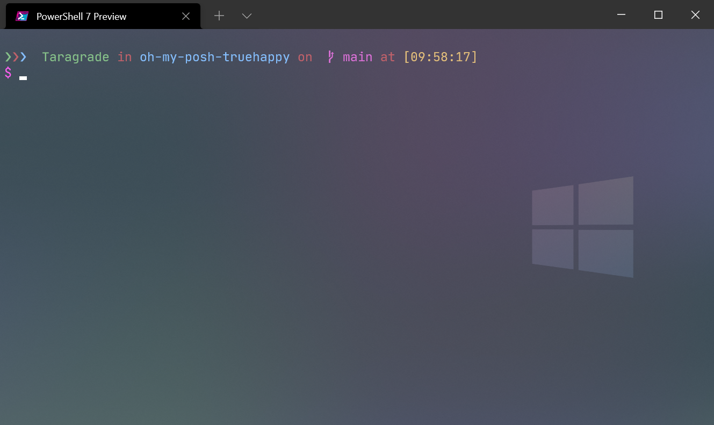
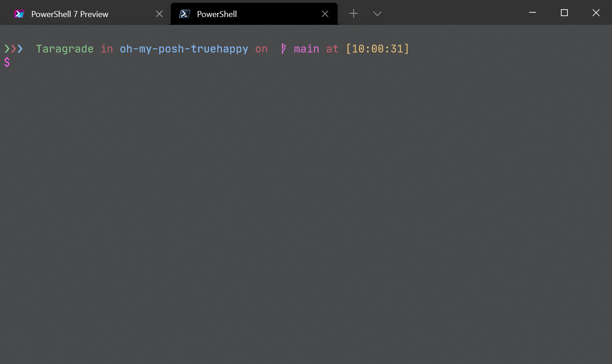
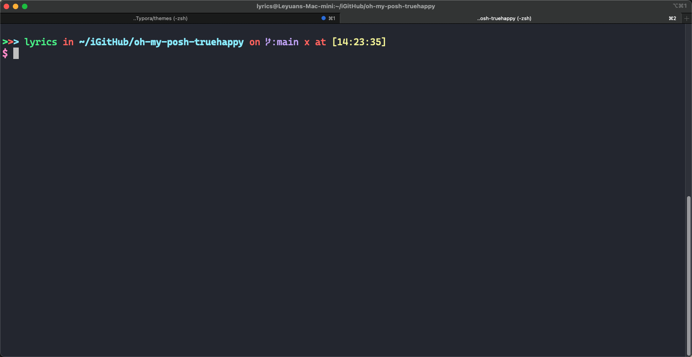

# oh-my-posh-truehappy
This is a oh-my-posh theme named truehappy. It used for Windows Terminal.

## 展示

在Powershell中





毛玻璃特效


在VS Code 中


oh-my-zsh truehappy主题



## 简介

用来自用的oh-myposh的主题"truehappy",这个主题配置的时候参考了很多其他的主题例如(material,space,ys等)。

## 特点

简单：没有过多复杂的图标（可能你喜欢那些炫酷的东西）。

多彩：配色上的确丰富了一点（使VS Code的pwsh和Windows Terminal中的pwsh配色都比较正常）。

提示：具备了一些简单的提示（比如git和python），但是还不多，不是没有考虑加入其他的语言的一些提示效果，显示效果和颜色有点复杂，后续考虑是否增加。

## 前提

- 已经会使用 Windows Terminals!
- 已经会设置 oh-my-posh!
- 有需要用Vs Code编程的需求，这一点非必需!
- 没有阅读障碍，并且有一定宽容心。

## 使用

讲truehappy.omp.json拷贝到{PowerShell_Path}\Powershell\Modules\oh-my-posh\version\themes\中。

参考地址：

`D:\Taragrade\Documents\PowerShell\Modules\oh-my-posh\3.173.0\themes`

通过`Set-PoshPrompt -Theme truehappy`使用。

考虑持久性可以通过在PowerShell中输入`notepad $profile`或者`code $profile`，将下面命令写入保存：

```powershell
# 引入 posh-git
Import-Module posh-git

# 引入 oh-my-posh
Import-Module oh-my-posh

# 设置 PowerShell 主题
# Get-PoshThemes查看所有主题
Set-PoshPrompt -Theme truehappy
```

## 附件

附上 Windows Terminal 的settings.json.

附上 PowerShell 的 profile 文件。
